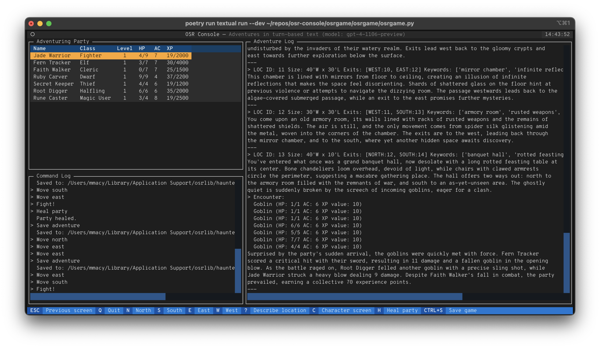

# About the project

The core of the OSR Console project is `osrlib`, a Python library intended for use as the game engine for a turn-based dungeon crawler RPG. There's also a text user interface (TUI) app that runs in the terminal, `osrgame`, that's useful for demoing and testing the library.

Development is currently focused on integrating core game systems into `osrlib`.

## osrlib

- [README.md](osrlib.md)
- [Source code](https://github.com/osrapps/osr-console/tree/main/osrlib)
- [API reference](reference/index.md)

## osrgame

The [osrgame](osrgame.md) package is a prototype-grade console application based on the [Textual](https://textual.textualize.io/) TUI framework. It mostly serves as a test bed for `osrlib` functionality.

## tests

The [tests](tests.md) package houses the Pytest-based unit and integration tests for `osrlib`.
